# 3d-printed-rc-car
A fully 3D-printed RC car designed in Autodesk Inventor with Arduino based motor and steering control.

## Overview
This project is a fully 3D-printed RC car designed and built from scratch.
The goal was to combine mechanical design, electronics, and manufacturing
into a functional vehicle using modular, non-soldered components.

## Features
- Fully 3D printed chassis and mounts
- Arduino based motor and steering control
- Modular design for easy maintenance
- Designed in Autodesk Inventor

## Tools & Technologies
- Autodesk Inventor
- Arduino Uno
- L298N Motor Driver
- PLA / TPU / PETG Filaments
- Bambu P1S and Ender 3 V2

## Design Process
- Concept and layout planning
- CAD modeling and tolerancing
- Test prints and fitment adjustments
- Final assembly and wiring

## Future Improvements
- Add Suspension
- Higher torque motor options
- Modular electronics layout with planned enclosure integration

## What I Learned
- Mechanical tolerancing for 3D printing
- Basic motor control using PWM
- Designing parts for manufacturability

## Project Images

## CAD Models and Drawings

### Arm Bar
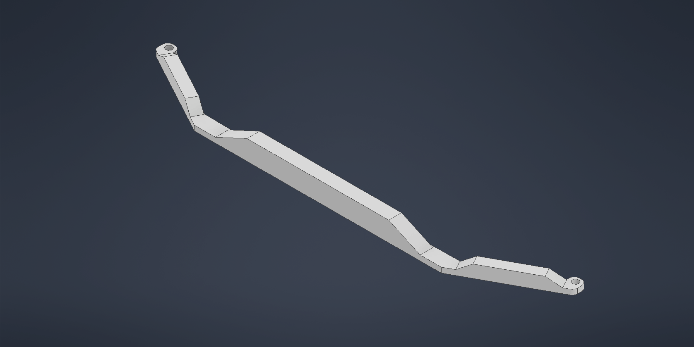
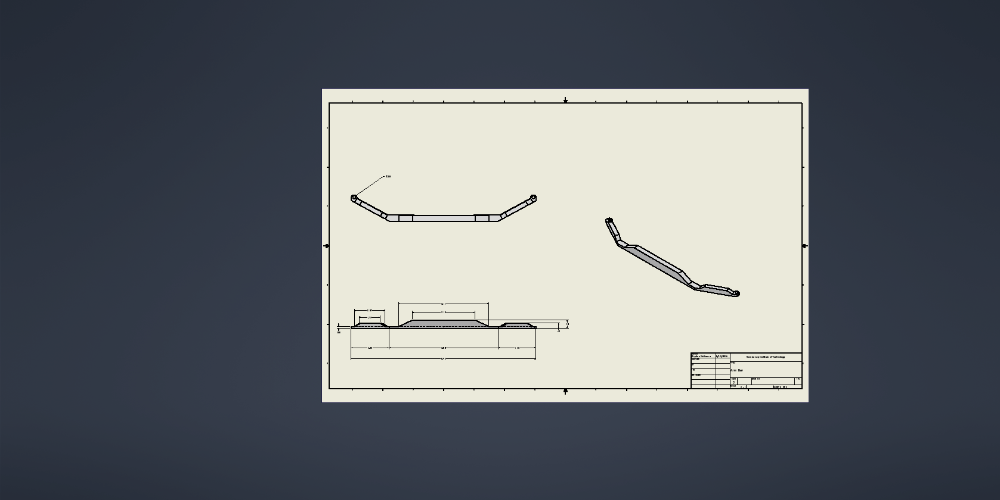

### Back Chassis
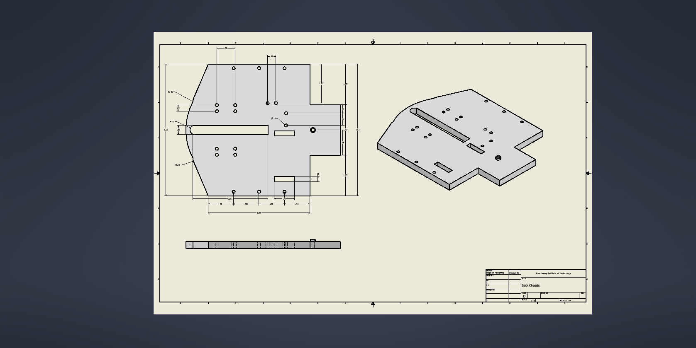

### Front Chassis
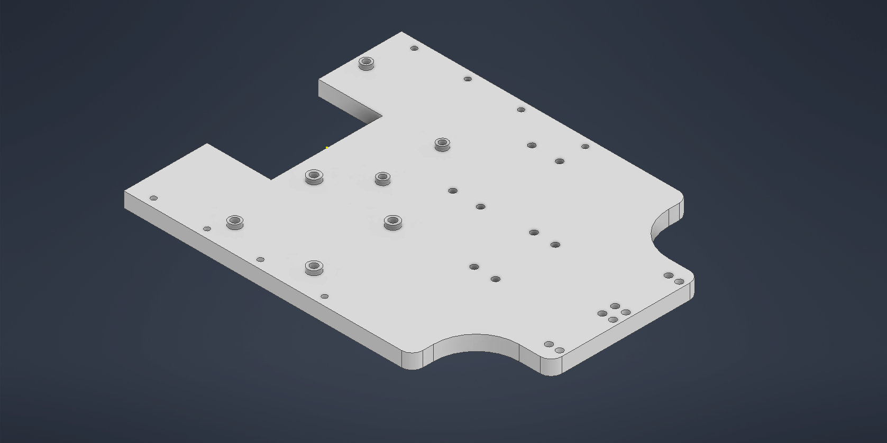
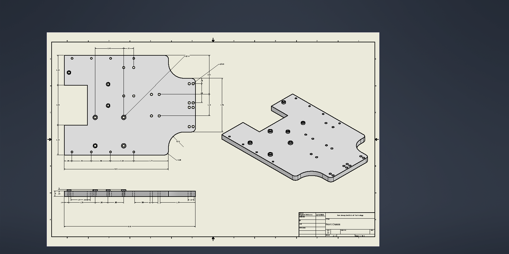

### Chassis Connection
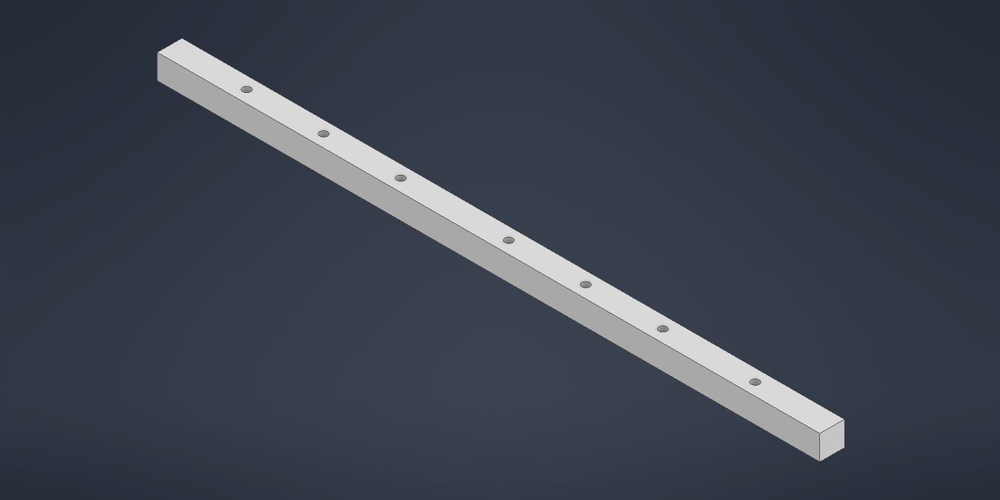
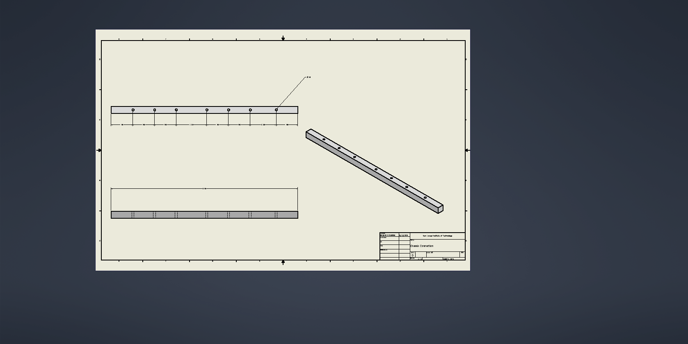

### Gear System

#### Drive Gear
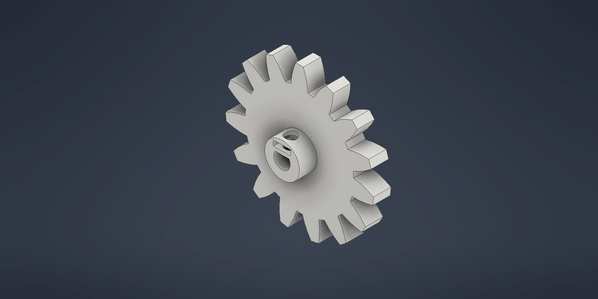
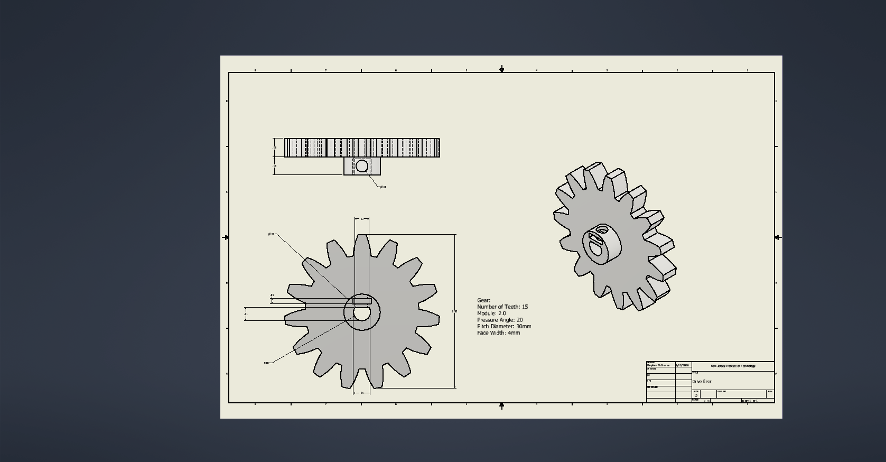

#### Driven Gear

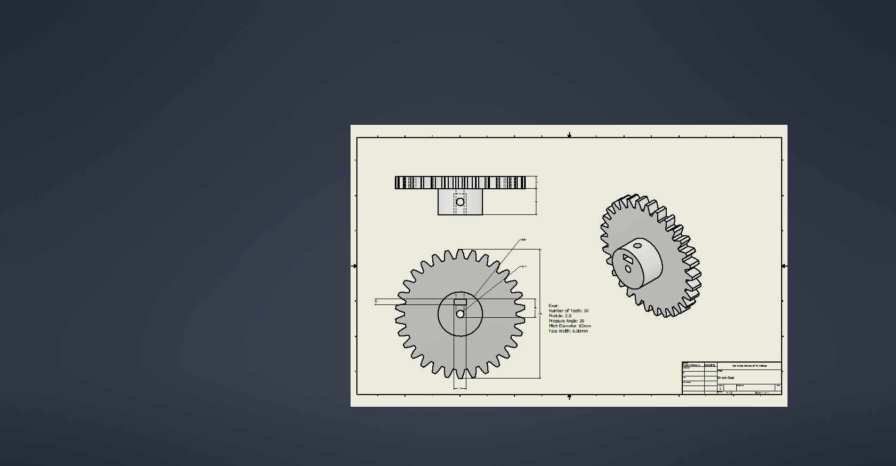

### Motor Mount
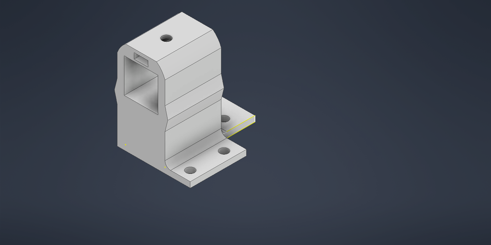
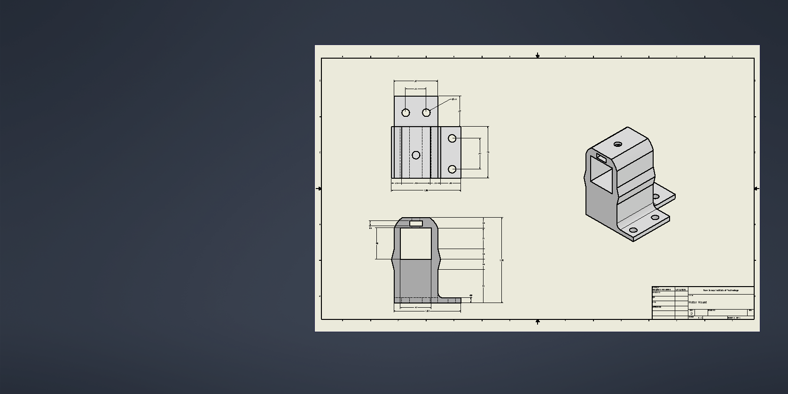
